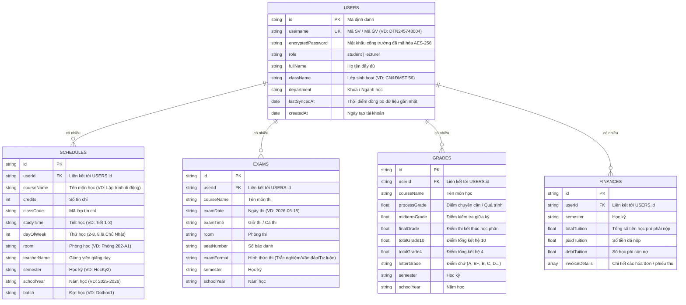

# 🎨 BẢN THIẾT KẾ CHI TIẾT: TUAF Schedule

**Ngày tạo**: 2026-05-27
**Dự án**: TUAF Schedule (Greenfield Project)
**Tài liệu tham khảo**: [implementation_plan.md](../.gemini/antigravity-ide/brain/92605a57-d48d-442b-a6bc-f74bc23bdc8e/implementation_plan.md)

---

## 📊 1. Cách Lưu Trữ Thông Tin (Database Schema - MongoDB)

Để lưu trữ đệm (Cache) dữ liệu cào về từ cổng thông tin trường TUAF một cách mềm dẻo và phản hồi siêu tốc dưới 50ms, chúng ta thiết kế cơ sở dữ liệu **MongoDB** gồm 5 bảng (Collections) chính:



---

## 📱 2. Danh Sách Màn Hình Ứng Dụng (Mobile Screens)

Ứng dụng di động **TUAF Schedule** mới sẽ có 5 màn hình chính được thiết kế hiện đại, responsive và trực quan:

```
┌────────────────────────────────────────────────────────────┐
│  🔐 MÀN HÌNH ĐĂNG NHẬP (LoginScreen)                       │
│  Mục đích: Xác thực tài khoản cổng trường của người dùng   │
│  Giao diện: Thiết kế Glassmorphism sang trọng, hiện đại.   │
│  Hiển thị: Ô nhập Mã đăng nhập, Mật khẩu, Switch chọn      │
│            vai trò (Sinh viên / Giảng viên).               │
│  Hành vi: Gửi thông tin về backend xác thực thử với cổng  │
│           trường. Nếu đúng -> mã hóa AES, lưu DB và cấp JWT.│
├────────────────────────────────────────────────────────────┤
│  🏠 MÀN HÌNH THỜI KHÓA BIỂU (DashboardScreen)               │
│  Mục đích: Xem lịch học (Sinh viên) hoặc lịch dạy (Giảng viên)│
│  Hiển thị: Lịch tuần dạng timeline ngang (vuốt qua lại),  │
│            danh sách môn học trong ngày (Ca học, phòng,    │
│            tên GV). Có nút Tab chuyển đổi sang LỊCH THI.  │
├────────────────────────────────────────────────────────────┤
│  📊 MÀN HÌNH KẾT QUẢ HỌC TẬP (GradeScreen)                  │
│  Mục đích: Xem chi tiết điểm số của Sinh viên             │
│  Hiển thị: Điểm trung bình tích lũy GPA (Vòng tròn màu sắc),│
│            bộ lọc theo học kỳ, bảng điểm chi tiết từng    │
│            môn (quá trình, giữa kỳ, thi, điểm chữ).       │
├────────────────────────────────────────────────────────────┤
│  💰 MÀN HÌNH TÀI CHÍNH & HỌC PHÍ (FinanceScreen)            │
│  Mục đích: Theo dõi công nợ học phí                       │
│  Hiển thị: Thẻ thống kê (Phải nộp - Đã nộp - Còn nợ) dạng  │
│            màu trực quan (Đỏ: còn nợ, Xanh: đã hoàn thành).│
│            Danh sách phiếu thu học phí chi tiết.           │
├────────────────────────────────────────────────────────────┤
│  👤 MÀN HÌNH TÀI KHOẢN & ĐỒNG BỘ (ProfileScreen)           │
│  Mục đích: Quản lý thông tin cá nhân & kích hoạt đồng bộ   │
│  Hiển thị: Ảnh đại diện cào từ trường, Họ tên, Lớp, Ngành.  │
│            Nút "ĐỒNG BỘ LẬP TỨC" (Kích hoạt cào realtime   │
│            khi người dùng muốn cập nhật điểm mới ngay).    │
└────────────────────────────────────────────────────────────┘
```

---

## 🚶 3. Hành Trình Người Dùng & Luồng Hoạt Động (User Journey)

### Luồng Đăng Nhập & Đồng Bộ Lần Đầu
1.  **Mở app**: Người dùng tải app lần đầu, thấy màn hình Login đẹp mắt.
2.  **Đăng nhập**: Nhập mã `DTN245748004` + mật khẩu cổng trường, chọn vai trò "Sinh viên", bấm Gửi.
3.  **Backend xử lý**:
    *   Thực hiện đăng nhập thử vào `https://sinhvien.tuaf.edu.vn/DangNhap/SaveToken`.
    *   Nếu sai tài khoản -> trả về lỗi "Thông tin tài khoản/mật khẩu không chính xác".
    *   Nếu đúng -> Backend lưu tài khoản vào MongoDB (mật khẩu được mã hóa AES-256), lập tức kích hoạt luồng cào dữ liệu: Lịch học, Lịch thi, Điểm số, Học phí.
    *   Lưu toàn bộ dữ liệu cào được vào Database đệm (Cache).
    *   Trả về JWT Token và thông tin cơ bản cho Mobile App.
4.  **Vào trang chủ**: Mobile App hiển thị màn hình Dashboard tải siêu tốc chỉ trong **0.1 giây** nhờ dữ liệu cache đã sẵn sàng!

---

## 📋 4. Checklist Kiểm Tra & Acceptance Criteria

### Tính năng: Đăng Nhập & Đồng Bộ
*   [ ] Nhập sai tài khoản/mật khẩu -> hiển thị thông báo lỗi màu đỏ rõ ràng, không lưu DB.
*   [ ] Đăng nhập thành công lần đầu -> backend lưu thông tin bảo mật, trích xuất cào dữ liệu và trả về JWT xác thực.
*   [ ] Mật khẩu được lưu trong MongoDB phải ở dạng mã hóa chuỗi byte (AES-256), tuyệt đối không lưu clear-text.

### Tính năng: Xem Lịch học & Lịch thi
*   [ ] Lịch học hiển thị đúng theo các Thứ trong tuần hiện tại.
*   [ ] Parse thành công lịch học phức tạp (môn học có lịch thực hành lẻ, đổi phòng học).
*   [ ] Tab Lịch thi hiển thị danh sách đợt thi theo đúng trình tự thời gian tăng dần.

### Tính năng: Tra cứu Điểm & Học phí
*   [ ] Hiển thị chính xác GPA toàn khóa và GPA học kỳ.
*   [ ] Màu sắc điểm tổng kết phân chia theo xếp loại (A/B+: Xanh lá, C/D: Vàng, F: Đỏ cảnh báo).
*   [ ] Xem được chi tiết số học phí còn nợ và chi tiết từng hóa đơn thu tiền của trường.

---

## 🧪 5. Thiết Kế Các Bài Kiểm Thử (Test Cases)

### TC-01: Luồng đăng nhập Sinh viên thành công (Happy Path)
*   **Given**: Cổng sinh viên TUAF hoạt động bình thường, tài khoản `DTN245748004` chính xác.
*   **When**: Nhập tài khoản/mật khẩu, chọn vai trò Sinh viên, bấm Đăng nhập.
*   **Then**:
    *   ✓ Đăng nhập thành công và nhận được JWT token.
    *   ✓ Dữ liệu Lịch học, Điểm, Học phí được cào và lưu vào database cache.
    *   ✓ Mobile app chuyển hướng vào Dashboard hiển thị đầy đủ lịch học.

### TC-02: Đăng nhập sai thông tin (Validation Path)
*   **Given**: Người dùng đang ở màn hình đăng nhập.
*   **When**: Nhập sai tài khoản hoặc mật khẩu, bấm Đăng nhập.
*   **Then**:
    *   ✓ Hệ thống hiển thị lỗi "Tài khoản hoặc mật khẩu không chính xác".
    *   ✓ Không chuyển hướng màn hình, không lưu bất kỳ thông tin nào vào DB.

### TC-03: Xem offline khi không có Internet (Edge Case)
*   **Given**: Người dùng đã đăng nhập thành công trước đó, thiết bị mất kết nối mạng.
*   **When**: Mở ứng dụng TUAF Schedule.
*   **Then**:
    *   ✓ Hệ thống hiển thị thông báo "Đang ở chế độ xem offline".
    *   ✓ Ứng dụng đọc dữ liệu lưu trữ từ SecureStore/AsyncStorage trên điện thoại và hiển thị đầy đủ lịch học cũ cho sinh viên.
