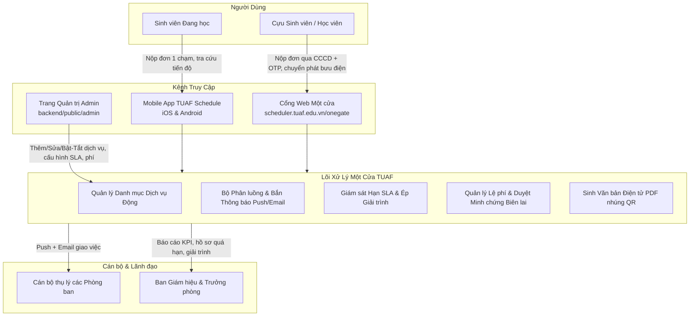
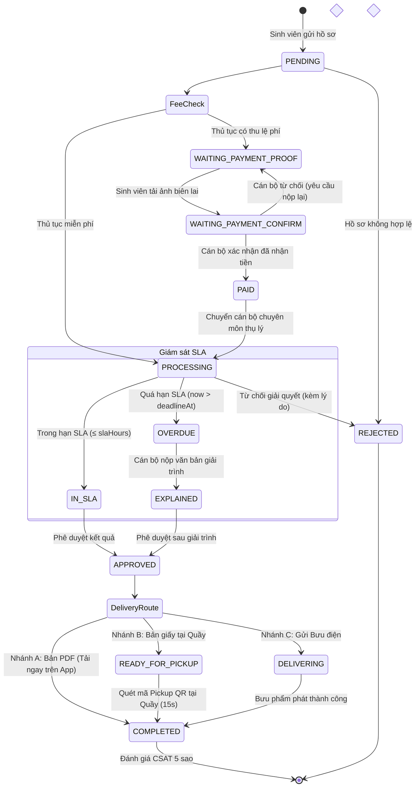
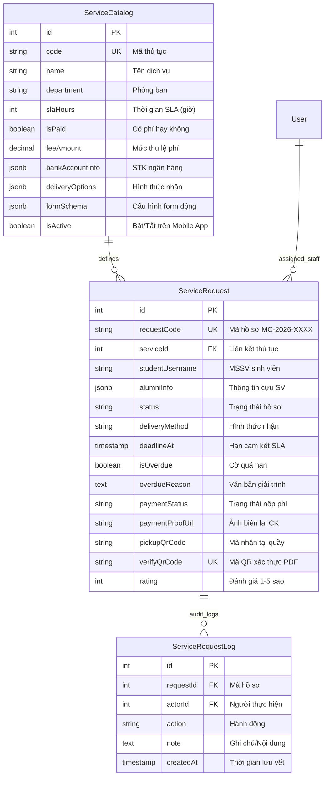

# 📋 BẢN TỔNG HỢP ĐỀ ÁN: PHÂN HỆ DỊCH VỤ MỘT CỬA SỐ
## TRƯỜNG ĐẠI HỌC NÔNG LÂM THÁI NGUYÊN (TUAF ONE-STOP SERVICE)

* **Mã đề án**: `TUAF-OSS-2026`
* **Phiên bản**: `v1.0.0`
* **Ngày phê duyệt tài liệu**: `07/10/2026`
* **Nền tảng ứng dụng**: Mobile App (React Native - TUAF Schedule) & Web Portal (`scheduler.tuaf.edu.vn`)
* **Đối tượng phục vụ**: Sinh viên đang học, Cựu sinh viên/học viên, Cán bộ các phòng ban, Ban Giám hiệu

---

## MỤC LỤC
1. [Bối cảnh & Căn cứ Pháp lý](#1-bối-cảnh--căn-cứ-pháp-lý)
2. [Kiến trúc Tổng thể & Kênh Tiếp cận](#2-kiến-trúc-tổng-thể--kênh-tiếp-cận)
3. [Quản lý Danh mục Dịch vụ Động từ Trang Admin](#3-quản-lý-danh-mục-dịch-vụ-động-từ-trang-admin)
4. [Danh mục Thủ tục Đề xuất & Lộ trình Thí điểm Cuốn chiếu](#4-danh-mục-thủ-tục-đề-xuất--lộ-trình-thí-điểm-cuốn-chiếu)
5. [Cơ chế Thu Lệ phí: Chuyển khoản & Đính kèm Minh chứng (Proof of Payment)](#5-cơ-chế-thu-lệ-phí-chuyển-khoản--đính-kèm-minh-chứng-proof-of-payment)
6. [Cơ chế Phân luồng & Bắn Thông báo Đa kênh (Push + Email)](#6-cơ-chế-phân-luồng--bắn-thông-báo-đa-kênh-push--email)
7. [Quản lý Thời hạn (SLA) & Quy trình Bắt buộc Giải trình Quá hạn](#7-quản-lý-thời-hạn-sla--quy-trình-bắt-buộc-giải-trình-quá-hạn)
8. [Tiến trình Trả Kết quả Đa phương thức](#8-tiến-trình-trả-kết-quả-đa-phương-thức)
9. [Đánh giá Hài lòng (CSAT 5 ⭐) & Cổng Xác thực Công khai](#9-đánh-giá-hài-lòng-csat-5--cổng-xác-thực-công-khai)
10. [Báo cáo Giám sát dành cho Lãnh đạo](#10-báo-cáo-giám-sát-dành-cho-lãnh-đạo)
11. [Mô hình Dữ liệu (Database Schema) & Danh mục API](#11-mô-hình-dữ-liệu-database-schema--danh-mục-api)
12. [Kế hoạch & Các Mốc Triển khai Kỹ thuật](#12-kế-hoạch--các-mốc-triển-khai-kỹ-thuật)

---

## 1. BỐI CẢNH & CĂN CỨ PHÁP LÝ

### 1.1. Khảo sát thực tiễn tại các cơ sở giáo dục đại học
* **Mô hình thành công**: HUST (*eHUST*), PTIT (*S-Link*), NEU (*onegate.neu.edu.vn* + Kiosk CIM), VNU (*OneVNU*), UNETI (*Hành chính Một cửa*).
* **Bài học kinh nghiệm**:
  1. Tuyệt đối không hardcode danh mục dịch vụ trên mobile app; toàn bộ phải quản lý động qua Admin Web Portal.
  2. Không phụ thuộc vào cổng thanh toán/webhook ngân hàng phức tạp; dùng cơ chế chuyển khoản ngân hàng kèm upload ảnh biên lai minh chứng.
  3. Cấp văn bản điện tử PDF nhúng mã QR xác thực trực tuyến để giảm 80% áp lực in ấn và sinh viên không cần đến trường lấy bản giấy.
  4. Mở rộng phục vụ Cựu sinh viên qua Web Portal không cần đăng nhập tài khoản app.

### 1.2. Căn cứ quy chuẩn pháp lý nhà nước
* **Nghị định số 61/2018/NĐ-CP & Nghị định số 118/2025/NĐ-CP của Chính phủ**:
  * Chuẩn hóa quy trình tiếp nhận, xử lý và trả kết quả theo cơ chế một cửa, một cửa liên thông.
  * Quy định rõ thời hạn xử lý (SLA), văn bản xin lỗi gia hạn hẹn trả kết quả khi xảy ra trễ hạn.
  * Quy định trách nhiệm giải trình bắt buộc của cán bộ khi để hồ sơ quá hạn.
* **Thông tư số 21/2019/TT-BGDĐT của Bộ Giáo dục và Đào tạo**:
  * Bản chính Bằng tốt nghiệp chỉ cấp 01 lần duy nhất; khi bị mất/hỏng, nhà trường cấp **"Bản sao văn bằng tốt nghiệp từ sổ gốc"** có giá trị pháp lý tương đương bản chính.

---

## 2. KIẾN TRÚC TỔNG THỂ & KÊNH TIẾP CẬN



---

## 3. QUẢN LÝ DANH MỤC DỊCH VỤ ĐỘNG TỪ TRANG ADMIN

Hệ thống bổ sung phân hệ **"📋 Dịch vụ Một cửa"** trên Trang Quản trị Admin (`backend/public/admin`). Toàn bộ dịch vụ được cấu hình động, **không hardcode trên mobile app**.

### 3.1. Các thông số cấu hình chi tiết cho mỗi thủ tục
Khi Admin nhấn **"+ Thêm thủ tục mới"** hoặc **"Chỉnh sửa"**, hệ thống cung cấp các trường:

| Nhóm thông tin | Tên trường cấu hình | Kiểu dữ liệu | Ý nghĩa & Quy tắc nghiệp vụ |
| :--- | :--- | :---: | :--- |
| **Thông tin chung** | **Tên dịch vụ** | `String` | Tên thủ tục hiển thị cho sinh viên (vd: *Giấy xác nhận SV vay vốn*). |
| | **Mã thủ tục (`code`)** | `String` | Mã duy nhất (vd: `XN_VAY_VON`, `CAP_THE_SV`, `BAN_SAO_BANG`). |
| | **Phòng ban (`department`)** | `Dropdown` | Phòng chịu trách nhiệm (*CTSV*, *Đào tạo*, *Khảo thí*, *KTX*, *KHTC*...). |
| | **Biểu tượng (`icon`)** | `Dropdown` | Tên icon Ionicons hiển thị trên App (`document-text`, `school`, `card`...). |
| | **Thứ tự hiển thị (`displayOrder`)**| `Integer` | Số thứ tự ưu tiên hiển thị trên danh mục app (số nhỏ xếp trước). |
| | **Mô tả ngắn** | `Text` | Hướng dẫn tóm tắt mục đích thủ tục và đối tượng áp dụng. |
| **Nhân sự phụ trách** | **Cán bộ thụ lý** | `String` | Họ tên cán bộ trực tiếp giải quyết hồ sơ. |
| | **Email cán bộ (`assigneeEmail`)**| `Email` | Hòm thư công vụ nhận thông báo khi có đơn mới nộp vào. |
| | **SĐT cán bộ (`assigneePhone`)** | `String` | Số điện thoại liên hệ hỗ trợ sinh viên. |
| | **Tài khoản App cán bộ** | `Dropdown` | Tài khoản trong hệ thống để bắn **Push Notification** vào điện thoại. |
| | **Lãnh đạo theo dõi** | `String` | Họ tên Trưởng/Phó phòng phụ trách. |
| | **Email Lãnh đạo (`leaderEmail`)** | `Email` | Nhận cảnh báo vi phạm SLA khi đơn quá hạn và nhận bản giải trình. |
| **Thời gian & Phí** | **Thời hạn SLA (`slaHours`)** | `Integer` | Số giờ làm việc cam kết hoàn thành (vd: `24`, `48`, `72` giờ). |
| | **Chính sách phí (`isPaid`)** | `Boolean` | `false`: Miễn phí; `true`: Có thu lệ phí. |
| | **Mức thu lệ phí (`feeAmount`)** | `Decimal` | Số tiền thu (vd: `35.000 VNĐ`). Mặc định `0`. |
| | **Thông tin tài khoản nhận** | `JSON` | Số tài khoản, Tên tài khoản, Ngân hàng thu sự nghiệp của Nhà trường. |
| **Hình thức trả** | **Hình thức nhận cho phép** | `Checkboxes`| `[x] Bản điện tử (PDF)`, `[x] Bản giấy tại Quầy`, `[x] Bưu điện`. |
| **Minh chứng & Đối tượng**| **Yêu cầu minh chứng** | `Dropdown` | `none`: Không cần; `optional`: Tùy chọn; `required`: Bắt buộc tải ảnh. |
| | **Hướng dẫn minh chứng** | `Text` | Lời dặn sinh viên loại giấy tờ cần chụp ảnh tải lên. |
| | **Mở cho Cựu SV (`allowAlumni`)** | `Boolean` | `true`: Hiển thị trên cổng Web One-Gate cho Cựu sinh viên. |
| **Trạng thái** | **Kích hoạt (`isActive`)** | `Boolean` | **Công tắc Bật/Tắt**: Bật thì mới xuất hiện trên Mobile App; tắt thì ẩn. |

### 3.2. Cơ chế đồng bộ tức thì lên Mobile App & Web
* Mobile App gọi API `GET /api/services` (lấy danh sách `where: { isActive: true }`, sắp xếp theo `displayOrder`).
* **Không cần cập nhật app**: Khi Nhà trường mở thêm thủ tục mới hoặc đổi cán bộ phụ trách, Admin chỉ cần lưu trên Web, toàn bộ sinh viên mở app lên là thấy ngay lập tức.
* **Form động thông minh**: Form trên App tự động ẩn/hiện ô nộp phí, ô upload minh chứng, hoặc ô nhập địa chỉ bưu điện dựa theo cấu hình của từng thủ tục.

### 3.3. Mô phỏng Giao diện Cấu hình Admin & Giao diện Mobile App

#### A. Wireframe Giao diện Quản trị viên (Admin Portal - Modal Thêm/Sửa Dịch vụ)
```text
┌─────────────────────────────────────────────────────────────────────────────┐
│ ⚙️ CẤU HÌNH THỦ TỤC DỊCH VỤ MỘT CỬA                           [✕ Đóng]      │
├─────────────────────────────────────────────────────────────────────────────┤
│ 1. THÔNG TIN CHUNG                                                          │
│    Tên thủ tục:    [ Giấy xác nhận sinh viên vay vốn NHCSXH               ] │
│    Mã thủ tục:     [ XN_VAY_VON          ]  Biểu tượng: [ document-text ▼ ] │
│    Phòng ban:      [ Phòng Công tác Sinh viên (CTSV)                   ▼ ] │
│    Thứ tự hiển thị:[ 1      ]  Mô tả: [ Cấp giấy xác nhận sinh viên để... ] │
│                                                                             │
│ 2. NHÂN SỰ PHỤ TRÁCH & LÃNH ĐẠO                                             │
│    Cán bộ thụ lý:  [ Nguyễn Văn B       ]  Email: [ vanb@tuaf.edu.vn      ] │
│    Số điện thoại:  [ 0987.654.321       ]  Tài khoản App: [ staff_ctsv_01▼] │
│    Lãnh đạo phòng: [ PGS.TS Trần Văn C  ]  Email: [ tranc@tuaf.edu.vn     ] │
│                                                                             │
│ 3. THỜI HẠN & LỆ PHÍ                                                        │
│    Thời hạn xử lý (SLA): [ 24 ] giờ (tính theo giờ hành chính)              │
│    Chính sách lệ phí:   (○) Miễn phí      (●) Có thu phí                    │
│    Mức thu lệ phí:      [ 35.000 ] VNĐ                                      │
│    Tài khoản nhận:      [ 8888.6666.9999 - Agribank Thái Nguyên - ĐH NL   ] │
│                                                                             │
│ 4. HÌNH THỨC TRẢ KẾT QUẢ & MINH CHỨNG                                       │
│    Hình thức nhận: [☑] Bản PDF (Mã QR)  [☑] Tại Quầy (Pickup QR)  [ ] Bưu điện│
│    Yêu cầu minh chứng: [ Tùy chọn (Optional)                           ▼ ] │
│    Mở cho Cựu SV:      [ ] Cho phép Cựu sinh viên nộp qua Cổng Web          │
│                                                                             │
│ 5. TRẠNG THÁI HIỂN THỊ TRÊN APP                                             │
│    Trạng thái:     [🔘 BẬT HOẠT ĐỘNG (Hiển thị ngay trên Mobile App)   ]   │
├─────────────────────────────────────────────────────────────────────────────┤
│                         [ Hủy bỏ ]   [ 💾 Lưu & Kích hoạt dịch vụ ]         │
└─────────────────────────────────────────────────────────────────────────────┘
```

#### B. Wireframe Giao diện Mobile App của Sinh viên (Tự thích ứng theo cấu hình Admin)
```text
┌─────────────────────────────────┐   ┌─────────────────────────────────┐
│ ☰  Dịch vụ Một cửa TUAF      🔔 │   │ ← Chi tiết hồ sơ #MC-2026-0042  │
├─────────────────────────────────┤   ├─────────────────────────────────┤
│ 🔍 Tìm kiếm thủ tục...          │   │ 🟢 ĐÃ TIẾP NHẬN - ĐANG XỬ LÝ    │
├─────────────────────────────────┤   │ Hạn cam kết: 17:00 08/10 (Còn 21h)│
│ DANH MỤC THỦ TỤC ĐANG MỞ (Active)│  ├─────────────────────────────────┤
│                                 │   │ [✓] 1. Nộp hồ sơ        08:30   │
│ 📄 Giấy xác nhận sinh viên      │   │ [✓] 2. Xác nhận học phí 08:45   │
│    Phòng CTSV • 24h • Miễn phí  │   │ [⏳] 3. Đang xử lý      Hiện tại│
│    [ Nộp hồ sơ ➔ ]              │   │ [ ] 4. Sẵn sàng nhận            │
│                                 │   ├─────────────────────────────────┤
│ 🎓 Cấp lại Thẻ sinh viên        │   │ 🏷️ HÌNH THỨC: NHẬN TẠI QUẦY     │
│    Phòng CTSV • 48h • 40.000đ   │   │                                 │
│    [ Nộp hồ sơ ➔ ]              │   │ ┌─────────────────────────────┐ │
│                                 │   │ │      ████████  ████         │ │
│ 🏢 Giấy giới thiệu thực tập     │   │ │      ██    ██    ██         │ │
│    Phòng Đào tạo • 24h • Miễn phí│  │ │      ████████  ████         │ │
│    [ Nộp hồ sơ ➔ ]              │   │ │       MÃ: MC-2026-0042      │ │
│                                 │   │ └─────────────────────────────┘ │
│ 📜 Cấp bản sao Bằng tốt nghiệp │   │ Xuất trình mã này tại Quầy Một  │
│    Phòng Đào tạo • 72h • 50.000đ│   │ cửa (P.102 Nhà Hiệu bộ) để nhận.│
└─────────────────────────────────┘   └─────────────────────────────────┘
```

---

## 4. DANH MỤC THỦ TỤC ĐỀ XUẤT & LỘ TRÌNH THÍ ĐIỂM CUỐN CHIẾU

```
┌─────────────────────────────────────────────────────────────────────────────┐
│ 🚀 LỘ TRÌNH TRIỂN KHAI CUỐN CHIẾU (GRADUAL ROLLOUT)                         │
├─────────────────────────────────────────────────────────────────────────────┤
│ • GIAI ĐOẠN 1 (Thí điểm MVP - 1-2 tuần đầu):                               │
│   1. Giấy xác nhận sinh viên (Vay vốn, hoãn NVQS, vé xe buýt) [CTSV, 24h]   │
│   2. Giấy giới thiệu liên hệ thực tập / làm khóa luận [Đào tạo, 24h]       │
│   3. Cấp lại thẻ sinh viên (mất/hỏng - Có phí 40.000đ) [CTSV, 48h]         │
│   4. Cấp bản sao Bằng tốt nghiệp cho Cựu SV (Có phí + Bưu điện) [ĐT, 72h]  │
├─────────────────────────────────────────────────────────────────────────────┤
│ • GIAI ĐOẠN 2 (Mở rộng Học vụ & Chế độ chính sách):                         │
│   5. Cấp bảng điểm học tập điện tử có mã QR [Đào tạo, 48h]                 │
│   6. Đơn xin hoãn thi / kiểm tra bù kết thúc học phần [Khảo thí, 72h]      │
│   7. Đơn xin phúc khảo bài thi (Có thu phí hoàn lại) [Khảo thí, 72h]       │
│   8. Đơn xin nghỉ học tạm thời / bảo lưu kết quả học tập [Đào tạo, 72h]    │
│   9. Đơn đề nghị miễn giảm học phí / trợ cấp xã hội NĐ 81 [CTSV, 72h]      │
│  10. Đăng ký Ký túc xá / Xác nhận ngoại trú [Ban Quản lý KTX, 48h]         │
├─────────────────────────────────────────────────────────────────────────────┤
│ • GIAI ĐOẠN 3 (Tự động hóa hoàn toàn):                                      │
│   11. Ký số Token/HSM tự động xuất bản văn bản PDF không cần duyệt thủ công │
│   12. Tích hợp API Bưu điện (tự động đẩy đơn & in phiếu gửi bưu điện)       │
│   13. Cổng Helpdesk / Ticket tiếp nhận giải đáp thắc mắc tự động (FAQ)      │
└─────────────────────────────────────────────────────────────────────────────┘
```

---

## 5. CƠ CHẾ THU LỆ PHÍ: CHUYỂN KHOẢN & ĐÍNH KÈM MINH CHỨNG (PROOF OF PAYMENT)

Loại bỏ hoàn toàn sự phụ thuộc vào Webhook ngân hàng phức tạp, áp dụng quy trình chuyển khoản trực tiếp kèm ảnh chụp biên lai giao dịch:

1. **Hiển thị Bảng tính tiền & Thông tin Chuyển khoản (kèm VietQR tiện ích)**:
   * Khi người nộp chọn thủ tục có phí: Hệ thống tính `Tổng tiền = (Đơn giá x Số lượng) + Cước bưu điện (nếu có)`.
   * Màn hình hiển thị:
     * **Số tiền**: (Ví dụ: `70.000 VNĐ`).
     * **Tài khoản thụ hưởng**: Trường Đại học Nông Lâm Thái Nguyên, Số tài khoản: `8888.6666.9999`, Ngân hàng Agribank Chi nhánh Thái Nguyên.
     * **Cú pháp nội dung chuyển khoản chuẩn**: `MC<MãHồSơ> <MSSV>` (Ví dụ: `MC20260042 2051010001`).
     * **Sinh mã VietQR chuẩn Napas247 động**:
       ```text
       https://api.vietqr.io/image/970405-888866669999-compact2.jpg?amount=70000&addInfo=MC20260042%202051010001&accountName=TRUONG%20DAI%20HOC%20NONG%20LAM%20TN
       ```
       *Sinh viên/Cựu SV mở bất kỳ ứng dụng Mobile Banking quét mã là ứng dụng tự điền chính xác 100% số tiền và cú pháp, loại bỏ hoàn toàn lỗi gõ nhầm.*

2. **Tải ảnh minh chứng chuyển khoản (Receipt Upload)**:
   * Chuyển khoản xong, người nộp chụp màn hình biên lai giao dịch thành công.
   * Nhấn nút: **"📸 Tải ảnh biên lai minh chứng"** (chọn ảnh từ thư viện hoặc chụp trực tiếp).
   * Bấm **"Gửi hồ sơ"** $\rightarrow$ Hồ sơ chuyển trạng thái: `CHỜ_XÁC_NHẬN_THANH_TOÁN`.

3. **Cán bộ tiếp nhận / Kế toán duyệt tiền 1 chạm qua Lightbox Modal**:
   * Cán bộ mở tab **"Chờ duyệt lệ phí"** $\rightarrow$ Click vào hồ sơ để mở cửa sổ đối soát nhanh:
   ```text
   ┌─────────────────────────────────────────────────────────────────────────────┐
   │ 🔎 ĐỐI SOÁT MINH CHỨNG THANH TOÁN - HỒ SƠ #MC-2026-0042           [✕ Đóng]  │
   ├──────────────────────────────────────┬──────────────────────────────────────┤
   │ ẢNH BIÊN LAI GIAO DỊCH (Phóng to)    │ THÔNG TIN ĐỐI CHIẾU HỆ THỐNG         │
   │                                      │                                      │
   │ ┌──────────────────────────────────┐ │ • Sinh viên:  Nguyễn Văn A (205101)  │
   │ │  [AGRIBANK E-MOBILE BANKING]     │ │ • Thủ tục:    Cấp lại thẻ sinh viên  │
   │ │  Giao dịch thành công            │ │ • Số tiền yc: 40.000 VNĐ             │
   │ │  Số tiền: 40.000 VND             │ │ • Đã nộp lúc: 08:42 07/10/2026       │
   │ │  Tới: TRUONG DH NONG LAM TN      │ │ • Cú pháp:    MC20260042 2051010001  │
   │ │  ND: MC20260042 2051010001       │ ├──────────────────────────────────────┤
   │ │  Mã GD: FT26280918237912         │ │ GHI CHÚ / PHẢN HỒI (Nếu từ chối):    │
   │ └──────────────────────────────────┘ │ [ Nhập lý do chuyển thiếu/ảnh mờ... ] │
   ├──────────────────────────────────────┴──────────────────────────────────────┤
   │ [🔴 Yêu cầu nộp lại biên lai]             [🟢 XÁC NHẬN ĐÃ NHẬN TIỀN (1 CHẠM)]│
   └─────────────────────────────────────────────────────────────────────────────┘
   ```
   * **Thao tác 1 chạm**:
     * 🟢 **"Xác nhận đã nhận tiền"**: Chuyển trạng thái sang `ĐÃ_THANH_TOÁN_CHỜ_XỬ_LÝ`, tự động chuyển tiếp cho cán bộ chuyên môn in ấn/làm bằng.
     * 🔴 **"Yêu cầu nộp lại"**: Nhập lý do (chuyển thiếu tiền, ảnh mờ) $\rightarrow$ Tự động gửi push notification/email yêu cầu người nộp tải lại ảnh biên lai đúng.

---

## 6. CƠ CHẾ PHÂN LUỒNG & BẮN THÔNG BÁO ĐA KÊNH (PUSH + EMAIL)

Mỗi khi sinh viên gửi đơn (hoặc khi lệ phí được xác nhận):
1. **Thông báo Đẩy tức thì (Push Notification trên App Cán bộ)**:
   * Hệ thống kích hoạt qua Expo Push API tới thiết bị của cán bộ được phân công:
   * *Nội dung*: `🔔 [Một cửa TUAF] Hồ sơ mới #MC-2026-0042: SV Nguyễn Văn A xin Giấy xác nhận SV. Hạn xử lý: 17:00 08/10/2026.`
   * Chạm vào thông báo sẽ mở thẳng màn hình chi tiết hồ sơ để xử lý.
2. **Email Công vụ Tức thì**:
   * Gửi email HTML trang trọng tới hòm thư cán bộ (`assigneeEmail`):
   * *Tiêu đề*: `[Một cửa TUAF] Tiếp nhận hồ sơ #MC-2026-0042 - Hạn xử lý: 17:00 08/10/2026`
   * *Nội dung*: Chi tiết thông tin sinh viên, mục đích xin giấy, tài liệu minh chứng kèm nút bấm **"Xử lý hồ sơ ngay"**.

---

## 7. QUẢN LÝ THỜI HẠN (SLA) & QUY TRÌNH BẮT BUỘC GIẢI TRÌNH QUÁ HẠN

### 7.1. Giám sát thời gian theo 3 mức màu sắc (Color Coding)
* `deadlineAt` được tính bằng `createdAt + slaHours` (tính theo giờ hành chính, tự động trừ ngày nghỉ T7, Chủ nhật).
* 🟢 **Trong hạn**: Đồng hồ đếm ngược thời gian còn lại (ví dụ: *"Còn 16 giờ"*).
* 🟡 **Sắp đến hạn (Còn $\le$ 4 giờ làm việc)**: Hệ thống tự động bắn Push Notification nhắc nhở cán bộ thụ lý: *"⚠️ Cảnh báo: Hồ sơ #MC-2026-0042 chỉ còn 4 giờ nữa là đến hạn xử lý!"*
* 🔴 **Quá hạn (`now > deadlineAt`)**:
  * Trạng thái hồ sơ tự động chuyển sang: `🔴 QUÁ HẠN`.
  * Gửi cảnh báo vi phạm SLA cho Cán bộ và đồng thời CC cho Lãnh đạo phòng (`leaderEmail`).
  * Tự động gửi thông báo xin lỗi kèm thời gian gia hạn đến sinh viên trên App (chuẩn theo Điều 19 Nghị định 61/2018/NĐ-CP).

### 7.2. Quy trình Bắt buộc Giải trình khi Quá hạn
Để chống việc để tồn đọng rồi âm thầm hoàn tất:
* Khi cán bộ mở đơn quá hạn để thao tác/hoàn thành, hệ thống **khóa nút duyệt thông thường** và mở popup: **"Báo cáo giải trình chậm trễ"**.
* Cán bộ bắt buộc chọn lý do chuẩn hóa và nhập diễn giải:
  1. *Chờ sinh viên bổ sung hồ sơ / minh chứng gốc.*
  2. *Cần thẩm định liên phòng ban (xác minh điểm, học phí, kỷ luật).*
  3. *Chờ Lãnh đạo / Hiệu trưởng phê duyệt ký đóng dấu.*
  4. *Sự cố kỹ thuật hệ thống hoặc quá tải đột xuất đầu học kỳ.*
  5. *Lý do khách quan khác (nhập văn bản diễn giải chi tiết).*
* Báo cáo giải trình được khóa vĩnh viễn vào nhật ký kiểm toán (Audit Trail) và hiển thị trực tiếp cho Lãnh đạo xem xét.

### 7.3. Sơ đồ Vòng đời Trạng thái Hồ sơ (State Transition Lifecycle)



---

## 8. TIẾN TRÌNH TRẢ KẾT QUẢ ĐA PHƯƠNG THỨC

```
                      ┌────────────────────────────────┐
                      │  CÁN BỘ HOÀN TẤT XỬ LÝ HỒ SƠ   │
                      └───────────────┬────────────────┘
                                      │
            ┌─────────────────────────┼─────────────────────────┐
            ▼                         ▼                         ▼
 ┌──────────────────────┐  ┌──────────────────────┐  ┌──────────────────────┐
 │ NHÁNH A: BẢN ĐIỆN TỬ │  │  NHÁNH B: BẢN GIẤY   │  │ NHÁNH C: BƯU ĐIỆN    │
 │ (Chiếm ~80% đơn)     │  │  (Tại Quầy Một cửa)  │  │ (Tận nhà cho Cựu SV) │
 │ • Sinh PDF nhúng QR  │  │ • In & đóng dấu đỏ   │  │ • Cán bộ đóng gói thư│
 │ • Tải/xem ngay trên  │  │ • Sinh mã Pickup QR  │  │ • Dán mã vận đơn     │
 │   App trong 1 giây   │  │ • Quét nhận 15 giây  │  │ • Cựu SV tra cứu bưu │
 │ • Email kèm file PDF │  │ • Ký nhận bàn giao   │  │   phẩm về tận nhà    │
 └──────────┬───────────┘  └──────────┬───────────┘  └──────────┬───────────┘
            └─────────────────────────┼─────────────────────────┘
                                      ▼
                      ┌────────────────────────────────┐
                      │  ĐÁNH GIÁ HÀI LÒNG (CSAT 5 ⭐)  │
                      │  • Đổ dữ liệu về Dashboard BGH │
                      └────────────────────────────────┘
```

1. **Nhánh A: Bản điện tử (Digital PDF - Nhanh nhất, tiện nhất)**:
   * Cán bộ duyệt $\rightarrow$ Hệ thống tự sinh file PDF chính thức nhúng **Mã QR Code xác thực duy nhất**.
   * Bắn Push Notification & Email gửi kèm file. Sinh viên mở App xem ngay, tải PDF về máy hoặc chia sẻ qua Zalo/Email.
2. **Nhánh B: Bản giấy có mộc đỏ (Tại Quầy Một cửa)**:
   * Cán bộ in, xin dấu mộc đỏ, xếp vào khay tài liệu và bấm `Sẵn sàng nhận kết quả`.
   * Sinh viên nhận thẻ **Mã QR Nhận kết quả (Pickup QR)** và mã rút gọn (vd: `#MC-0042`) trên App.
   * Sinh viên đến quầy đưa mã QR cho cán bộ quét bằng camera/máy quét trong 15 giây $\rightarrow$ Cán bộ lấy đúng khay giấy trao cho sinh viên $\rightarrow$ Ký nhận $\rightarrow$ Đóng đơn.
3. **Nhánh C: Chuyển phát bưu điện tận nhà (Dành cho Cựu SV ở xa)**:
   * Cán bộ đóng gói, dán mã vận đơn bưu chính (VNPost / Viettel Post) $\rightarrow$ Cựu sinh viên nhận mã vận đơn để tra cứu hành trình bưu phẩm về tận cửa nhà.

---

## 9. ĐÁNH GIÁ HÀI LÒNG (CSAT 5 ⭐) & CỔNG XÁC THỰC CÔNG KHAI

### 9.1. Đánh giá Mức độ Hài lòng của Sinh viên
* Ngay sau khi sinh viên tải bản PDF thành công hoặc nhận bản giấy tại quầy, App hiển thị pop-up đánh giá 1 chạm:
  * Điểm số: 1 đến 5 sao (⭐ ⭐ ⭐ ⭐ ⭐).
  * Tiêu chí nhanh: *Tốc độ xử lý*, *Thái độ phục vụ*, *Chất lượng văn bản*.
  * Ý kiến góp ý ngắn (tùy chọn).
* Điểm số CSAT trung bình được cập nhật theo thời gian thực lên Dashboard Lãnh đạo.

### 9.2. Cổng Xác thực Công khai (Public Verification Portal)
* Bất kỳ ai (nhà tuyển dụng, ngân hàng, công an) dùng camera điện thoại quét mã QR trên giấy tờ sẽ mở trang:
  `https://scheduler.tuaf.edu.vn/verify/<documentCode>`
* Hiển thị xác nhận: Huy hiệu chính thức của Trường ĐH Nông Lâm Thái Nguyên, Tên sinh viên, MSSV, Số quyết định, Ngày cấp, Người ký, và bản xem trước tài liệu gốc để đối chiếu, **chống tuyệt đối giấy tờ giả mạo**.

---

## 10. BÁO CÁO GIÁM SÁT DÀNH CHO LÃNH ĐẠO

1. **Dashboard Thời gian thực (Ban Giám hiệu & Trưởng phòng)**:
   * KPI toàn trường: Tổng tiếp nhận, Tỷ lệ đúng hạn (%), Số đơn quá hạn, Doanh thu lệ phí, Điểm CSAT.
   * Bảng xếp hạng năng suất theo từng Phòng ban và từng Cán bộ.
   * Tab **"Hồ sơ Quá hạn & Giải trình"**: Xem danh sách các hồ sơ trễ hạn, đọc nguyên văn lý do giải trình của cán bộ, có khung nhập **"Ý kiến chỉ đạo / Nhắc nhở"** gửi thẳng cho cán bộ.
2. **Weekly Executive Digest Email**:
   * Tự động gửi lúc **17:00 thứ Sáu hàng tuần** tới Ban Giám hiệu và Trưởng các phòng ban, tổng kết tình hình một cửa trong tuần.

---

## 11. MÔ HÌNH DỮ LIỆU (DATABASE SCHEMA) & DANH MỤC API

### 11.1. Sơ đồ Thực thể Quan hệ (Entity Relationship Diagram)



### 11.2. Chi tiết các Bảng CSDL (PostgreSQL / SQLite via Sequelize)

#### Bảng `ServiceCatalog` (Danh mục Dịch vụ động)
| Tên cột | Kiểu dữ liệu | Ràng buộc | Mô tả |
| :--- | :--- | :---: | :--- |
| `id` | `INTEGER` | PK, Auto | Khóa chính |
| `code` | `VARCHAR(50)` | UNIQUE, NOT NULL | Mã thủ tục (vd: `XN_VAY_VON`) |
| `name` | `VARCHAR(255)` | NOT NULL | Tên thủ tục hiển thị |
| `department` | `VARCHAR(100)` | NOT NULL | Phòng ban phụ trách (`CTSV`, `DAO_TAO`...) |
| `icon` | `VARCHAR(50)` | DEFAULT 'document-text' | Biểu tượng hiển thị trên App |
| `description` | `TEXT` | NULL | Mô tả & hướng dẫn thủ tục |
| `displayOrder` | `INTEGER` | DEFAULT 0 | Thứ tự hiển thị |
| `slaHours` | `INTEGER` | DEFAULT 24 | Thời gian cam kết xử lý (giờ hành chính) |
| `assigneeName` | `VARCHAR(100)` | NULL | Họ tên cán bộ thụ lý |
| `assigneeEmail` | `VARCHAR(100)` | NULL | Email cán bộ nhận thông báo đơn mới |
| `assigneePhone` | `VARCHAR(30)` | NULL | Số điện thoại cán bộ |
| `assigneeUserId`| `INTEGER` | FK User, NULL | Tài khoản app cán bộ (để bắn push) |
| `leaderName` | `VARCHAR(100)` | NULL | Họ tên Lãnh đạo phòng theo dõi |
| `leaderEmail` | `VARCHAR(100)` | NULL | Email Lãnh đạo nhận cảnh báo quá hạn |
| `isPaid` | `BOOLEAN` | DEFAULT false | Có thu lệ phí không |
| `feeAmount` | `DECIMAL(12,2)` | DEFAULT 0 | Mức thu lệ phí |
| `bankAccountInfo` | `JSONB` | NULL | Thông tin tài khoản trường nhận tiền |
| `deliveryOptions` | `JSONB` | DEFAULT '["digital"]' | Các hình thức nhận kết quả cho phép |
| `formSchema` | `JSONB` | NULL | Định nghĩa các trường động bổ sung (vd: lý do, số bản, học kỳ...) |
| `requiresAttachment`| `VARCHAR(20)`| DEFAULT 'none' | `none`, `optional`, `required` |
| `attachmentGuide` | `TEXT` | NULL | Hướng dẫn tài liệu minh chứng cần nộp |
| `allowAlumni` | `BOOLEAN` | DEFAULT false | Cho phép Cựu sinh viên đăng ký qua Web |
| `isActive` | `BOOLEAN` | DEFAULT true | **Công tắc Bật/Tắt hiển thị trên App & Web** |

#### Bảng `ServiceRequest` (Hồ sơ Yêu cầu)
| Tên cột | Kiểu dữ liệu | Ràng buộc | Mô tả |
| :--- | :--- | :---: | :--- |
| `id` | `INTEGER` | PK, Auto | Khóa chính |
| `requestCode` | `VARCHAR(30)` | UNIQUE, NOT NULL | Mã hồ sơ (vd: `MC-2026-0042`) |
| `isAlumni` | `BOOLEAN` | DEFAULT false | Đơn của Cựu sinh viên hay SV đang học |
| `studentUsername`| `VARCHAR(50)` | NULL | MSSV (nếu là SV đang học) |
| `alumniInfo` | `JSONB` | NULL | Họ tên, CCCD, ngày sinh, năm TN, SĐT, email cựu SV |
| `serviceId` | `INTEGER` | FK ServiceCatalog | Thủ tục đăng ký |
| `formData` | `JSONB` | NULL | Dữ liệu form bổ sung (lý do, số bản...) |
| `status` | `VARCHAR(30)` | DEFAULT 'PENDING' | Trạng thái: `PENDING`, `WAITING_PAYMENT_PROOF`, `WAITING_PAYMENT_CONFIRM`, `PAID`, `PROCESSING`, `APPROVED`, `READY_FOR_PICKUP`, `DELIVERING`, `COMPLETED`, `REJECTED`, `CANCELLED` |
| `deliveryMethod`| `VARCHAR(30)` | DEFAULT 'digital' | `digital`, `physical_pickup`, `postal_delivery` |
| `postalAddress` | `TEXT` | NULL | Địa chỉ nhận bưu điện (nếu có) |
| `postalTrackingNumber`| `VARCHAR(50)` | NULL | Mã vận đơn bưu chính VNPost/ViettelPost |
| `assignedTo` | `INTEGER` | FK User, NULL | Cán bộ đang trực tiếp thụ lý |
| `submittedAt` | `TIMESTAMP` | NOT NULL | Thời điểm nộp đơn |
| `deadlineAt` | `TIMESTAMP` | NOT NULL | Hạn chót hoàn thành theo SLA |
| `completedAt` | `TIMESTAMP` | NULL | Thời điểm hoàn thành thực tế |
| `pickedUpAt` | `TIMESTAMP` | NULL | Thời điểm sinh viên nhận kết quả |
| `pickupQrCode` | `VARCHAR(50)` | NULL | Chuỗi mã nhận kết quả tại quầy |
| `isOverdue` | `BOOLEAN` | DEFAULT false | Đã từng bị quá hạn hay chưa |
| `overdueReason` | `TEXT` | NULL | Báo cáo giải trình lý do quá hạn của cán bộ |
| `overdueExplainedAt`| `TIMESTAMP` | NULL | Thời điểm nộp giải trình |
| `overdueExplainedBy`| `INTEGER` | FK User, NULL | Cán bộ nộp giải trình |
| `feeAmount` | `DECIMAL(12,2)` | DEFAULT 0 | Tổng lệ phí phải nộp (kèm cước bưu điện) |
| `paymentStatus` | `VARCHAR(20)` | DEFAULT 'UNPAID' | `UNPAID`, `PENDING_CONFIRM`, `PAID`, `REJECTED_PROOF` |
| `paymentProofUrl`| `TEXT` | NULL | Đường dẫn ảnh chụp biên lai chuyển khoản |
| `paymentConfirmedAt`| `TIMESTAMP`| NULL | Thời điểm cán bộ duyệt tiền |
| `paymentConfirmedBy`| `INTEGER` | FK User, NULL | Cán bộ/Kế toán duyệt tiền |
| `resultPdfUrl` | `TEXT` | NULL | File PDF kết quả chính thức |
| `verifyQrCode` | `VARCHAR(64)` | UNIQUE, NULL | Chuỗi định danh tra cứu công khai |
| `rating` | `INTEGER` | NULL | Điểm đánh giá (1 - 5 sao) |
| `ratingComment`| `TEXT` | NULL | Nhận xét góp ý của sinh viên |

#### Bảng `ServiceRequestLog` (Nhật ký xử lý & Kiểm toán)
* `id`, `requestId` (FK), `actorId` (FK User), `action` (`SUBMIT`, `UPLOAD_RECEIPT`, `PAYMENT_CONFIRMED`, `PAYMENT_REJECTED`, `START_PROCESS`, `APPROVE`, `READY_PICKUP`, `POSTAL_DISPATCH`, `HANDOVER`, `OVERDUE_EXPLAIN`, `COMPLETE`, `RATING`), `note`, `createdAt`.

---

### 11.3. Danh mục API RESTful

#### A. Nhóm API Quản trị viên (Admin Portal):
* `GET /api/admin/services`: Lấy danh sách toàn bộ thủ tục (kèm lọc phòng ban, trạng thái active/inactive).
* `POST /api/admin/services`: Thêm mới thủ tục với đầy đủ thông số cấu hình.
* `PUT /api/admin/services/:id`: Chỉnh sửa toàn bộ cấu hình thủ tục.
* `PATCH /api/admin/services/:id/toggle`: **Bật/Tắt kích hoạt thủ tục nhanh 1 chạm**.
* `DELETE /api/admin/services/:id`: Xóa hoặc lưu trữ thủ tục.
* `GET /api/admin/overview`: Thống kê KPI toàn trường, tỷ lệ đúng hạn/quá hạn, doanh thu lệ phí, điểm CSAT.
* `GET /api/admin/overdue-reports`: Báo cáo chi tiết các hồ sơ trễ hạn và giải trình của cán bộ.
* `POST /api/admin/send-digest`: Kích hoạt gửi email báo cáo tuần cho Ban Giám hiệu.

#### B. Nhóm API Sinh viên & Cựu sinh viên (App & Web):
* `GET /api/services`: **Lấy danh mục thủ tục đang hoạt động** (`isActive = true`) để render giao diện động trên App/Web.
* `POST /api/services/requests`: Tạo yêu cầu mới (kèm file minh chứng nếu có).
* `POST /api/services/requests/:id/upload-receipt`: Tải ảnh biên lai minh chứng chuyển khoản.
* `GET /api/services/my-requests`: Danh sách đơn của sinh viên kèm trạng thái, đếm ngược SLA và mã nhận kết quả.
* `GET /api/services/requests/:id`: Chi tiết tiến trình hồ sơ, file PDF kết quả, thông tin tài khoản chuyển khoản hoặc mã vận đơn.
* `GET /api/services/public/track`: Tra cứu hồ sơ dành riêng cho cựu sinh viên (bằng mã hồ sơ + CCCD).
* `POST /api/services/requests/:id/rate`: Sinh viên đánh giá chất lượng dịch vụ (1 - 5 sao).

#### C. Nhóm API Cán bộ thụ lý & Tiếp tân:
* `POST /api/services/staff/requests/:id/confirm-payment`: Cán bộ Một cửa / Kế toán xác nhận biên lai hợp lệ $\rightarrow$ chuyển trạng thái đã nộp tiền.
* `POST /api/services/staff/requests/:id/reject-payment`: Cán bộ từ chối biên lai kèm lý do (thiếu tiền, ảnh mờ) $\rightarrow$ yêu cầu nộp lại.
* `GET /api/services/staff/requests`: Danh sách hồ sơ được phân công (lọc: Chờ duyệt tiền, Mới, Đang xử lý, Quá hạn, Chờ trả).
* `PATCH /api/services/staff/requests/:id/status`: Cập nhật trạng thái (Tiếp nhận, Duyệt, Sẵn sàng nhận, Bàn giao bưu điện).
* `POST /api/services/staff/requests/:id/handover`: Quét mã Pickup QR của sinh viên tại quầy để xác nhận đã trả kết quả.
* `POST /api/services/staff/requests/:id/dispatch-postal`: Cập nhật mã vận đơn bưu điện (VNPost / Viettel Post).
* `POST /api/services/staff/requests/:id/explain-overdue`: Gửi báo cáo giải trình lý do quá hạn.
* `POST /api/services/staff/requests/:id/generate-pdf`: Tự động sinh PDF có mã QR xác thực.

#### D. Cổng Tra cứu Công khai:
* `GET /api/services/verify/:documentCode`: Trang web công khai xác thực văn bản gốc qua mã QR.

---

## 12. KẾ HOẠCH & CÁC MỐC TRIỂN KHAI KỸ THUẬT

1. **Mốc 1 (Cơ sở Dữ liệu & Backend Models)**:
   * Tạo các migration & model: `ServiceCatalog`, `ServiceRequest`, `ServiceRequestLog`.
   * Viết seeder nạp dữ liệu mẫu ban đầu cho 4 dịch vụ cốt lõi.
2. **Mốc 2 (Giao diện Admin Quản lý Danh mục Dịch vụ Động)**:
   * Xây dựng tab "Dịch vụ Một cửa" trong `backend/public/admin/index.html`.
   * Form modal Thêm / Sửa / Bật-Tắt thủ tục với đầy đủ các cấu hình nhân sự, SLA, lệ phí.
3. **Mốc 3 (Hệ thống Thông báo Đa kênh & SLA Engine)**:
   * Tích hợp gửi Push Notification và Email tự động cho cán bộ phụ trách và lãnh đạo.
   * Thiết lập Cronjob quét SLA định kỳ, tự động đánh dấu quá hạn và kích hoạt luồng giải trình bắt buộc.
4. **Mốc 4 (Giao diện Mobile App Sinh viên - Dynamic UI)**:
   * Xây dựng màn hình Một cửa lấy dữ liệu động từ API `GET /api/services`.
   * Form nộp đơn pre-fill thông minh, upload minh chứng, upload biên lai chuyển khoản.
   * Màn hình theo dõi tiến trình (stepper timeline), xem/tải PDF và thẻ mã Pickup QR.
5. **Mốc 5 (Giao diện Cán bộ Thụ lý & Quầy Tiếp tân)**:
   * Màn hình duyệt đơn, xem ảnh biên lai phóng to (lightbox) duyệt tiền 1 chạm.
   * Modal bắt buộc nhập giải trình khi quá hạn.
   * Quét mã Pickup QR để bàn giao giấy tờ tại quầy trong 15 giây.
6. **Mốc 6 (Cổng Web Cựu Sinh viên & Trang Xác thực QR Công khai)**:
   * Trang Web nộp đơn cho Cựu sinh viên qua CCCD + OTP và chuyển phát bưu điện.
   * Trang công khai xác thực văn bản chống làm giả `https://scheduler.tuaf.edu.vn/verify/<documentCode>`.
7. **Mốc 7 (Kiểm thử Toàn diện & Bàn giao Thí điểm)**:
   * Viết bộ kiểm thử tự động (Unit test, Integration test).
   * Thử nghiệm thực tế với 2 thủ tục Giai đoạn 1 tại Trường ĐH Nông Lâm Thái Nguyên.
